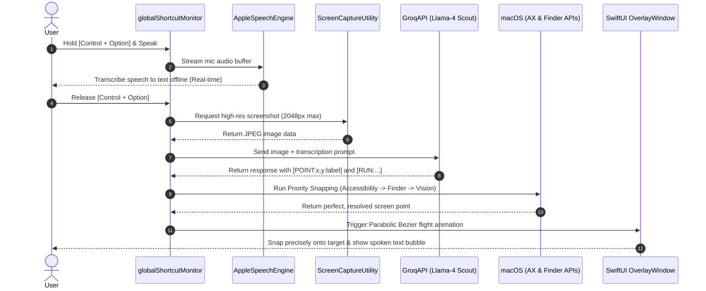

# 🎙️ ECHO: Glowing Agentic Voice Companion & Real-Time On-Screen Mentor for macOS

<p align="center">
  
</p>

<p align="center">
  <strong>An always-on visual AI companion that lives directly in your macOS menu bar, guiding you in real-time.</strong>
</p>

<p align="center">
  <a href="#-about-the-project"></a>
  <a href="#%EF%B8%8F-tech-stack"></a>
  <a href="LICENSE"></a>
  <a href="#-improved-by"></a>
</p>

---

## 💡 About the Project & The Vision

**Echo** is a premium, always-on visual AI companion for macOS. Driven by a simple global keyboard shortcut, Echo looks at your screen, listens to your voice instructions, and translates your intentions into physical operating system interactions—like soaring across monitors to **point out specific options**, **open local directories**, or programmatically **closing Finder windows**.

### 🌟 The Inspiration
This project is inspired by the original open-source **`learning-buddy`** assistant created by **Farza** (MIT License). 

While preserving the magical essence of an on-screen visual companion that physically flies along physics-based arcing curves, **Aditya Gupta** has extensively re-engineered the application, introducing a powerful **Agentic click-sync layer** and deep OS automation. We are still actively developing and constantly improving this project to reach its full potential.

### 🎯 Our Mission: Breaking "Tutorial Hell"
> **The Core Aim:** To create an interactive AI companion that helps **beginners, self-learners, and non-trained individuals** directly master any software in real-time, right inside the application they are trying to learn. 
>
> Traditionally, learning new software means constantly changing tabs, pausing a YouTube tutorial, switching back to the app, making a mistake, and repeating this frustrating cycle. **Echo destroys this friction.** It acts as a visual, interactive tutor directly on top of your workspace—guiding your eyes, highlighting buttons, and opening resources without you ever leaving your active window.

---

## ⚡ Key Features

* **Parabolic Bezier Flight:** The companion (a glowing blue triangle) does not simply teleport. It flies along physics-based quadratic curves, rotating dynamically to align with its trajectory, scaling up at the apex, and landing exactly on target.
* **Push-To-Talk Listening:** Hold down `Control + Option` to transform the companion into an active, glowing blue voice waveform that listens to your queries.
* **Offline Local Transcription:** Uses macOS's native, offline **Apple Speech framework** to transcribe your voice locally on-device. No audio files are sent over the network, ensuring complete privacy.
* **Agentic OS Integration:** Dynamically parses voice instructions into structured local actions, like opening paths or automating UI clicks.
* **Starvation-Proof Timers:** Core tracking and animations are scheduled on `RunLoop.main` in `.common` mode, preventing the cursor from freezing even during heavy UI interaction (like window dragging).

---

## 🏗️ Technical Architecture & Pipeline

Echo's operation is structured into 6 highly optimized stages that run sequentially on the main thread and background tasks:



---

## 🛠️ Tech Stack

| Layer | Technologies Used |
| :--- | :--- |
| **Core Frameworks** | `SwiftUI`, `AppKit`, `Foundation`, `Combine` |
| **System Automation** | `CoreGraphics`, `Accessibility API (AXUIElement)`, `NSAppleScript` |
| **Screen Capture** | `ScreenCaptureKit` (Optimized display filtering) |
| **Voice Processing** | `AVFoundation` (Microphone recording), `Speech` (Offline transcription) |
| **AI LLM API** | `Groq Vision API` (Low latency endpoint) |
| **Vision Model** | `meta-llama/llama-4-scout-17b-16e-instruct` |
| **Text-To-Speech** | `ElevenLabs TTS` (with Apple System speech fallback) |

---

## 🚀 The Improvements We Made (Deep Engineering)

To make Echo a truly production-grade tool with pixel-perfect accuracy, we built several core custom systems on top of the original prototype:

### 1. Robust Case/Space-Insensitive Coordinate Parsing
* **Problem:** Original regex parsers were rigid and expected exact integer coordinates with no spaces. Standard Llama models frequently output float coordinates (like `0.074` for percentages) or add standard spacing (`[POINT: 810, 0.074 : microsoft]`), causing the previous parser to fail and read raw coordinates out loud.
* **Solution:** Rewrote the parser using a case-insensitive, whitespace-tolerant pattern (`#"\[\s*POINT\s*:\s*(?:none|(\d+(?:\.\d+)?)\s*,\s*(\d+(?:\.\d+)?)...)\s*\]"#`). All tags are stripped cleanly from spoken text, and normalized decimal coordinates (0.0 to 1.0) are automatically detected and scaled to matching pixel coordinates based on the screen size.

### 2. High-Resolution Display Captures
* **Problem:** Screenshots were previously limited to a max dimension of `1280` pixels, which heavily blurred small text (like *"Battery"* or *"Displays"* in System Settings) on high-density Retina displays.
* **Solution:** Increased the capture limit to **`2048` max dimension**, delivering crisp text resolution to the vision model and dramatically reducing AI hallucination.

### 3. High-Priority Snapping Override Pipeline
* **Problem:** Vision coordinate regression is never 100% pixel-perfect (often off by 20–40 pixels).
* **Solution:** Built a multi-layered coordinate resolution pipeline that executes in this priority order:
  1. **Accessibility Snap:** Grabs the frontmost window and recursively traverses the **Accessibility Tree (`AXUIElement`)** to locate a button or menu option matching the spoken text (e.g. *"Battery"*). If found, it snaps *exactly* to its OS-level center point.
  2. **Finder Desktop Snap:** Runs a safe AppleScript Finder check. If pointing to a Desktop item (e.g. your folder `"KURSOR"`), it overrides coordinates with Finder's exact desktop grid icon positions.
  3. **High-Res Vision Snap:** Falls back to AI vision guesses if pointing to abstract coordinate targets.

---

## 📂 Project Structure

```
clicky-main/
├── README.md                 # Project vision, features, and setup
├── ARCHITECTURE.md           # Deep-dive module breakdowns
├── build.sh                  # Custom compilation & codesigning script
├── create_icns.sh            # macOS AppIcon generator (portable)
├── echo/                     # Core Swift Code
│   ├── echoApp.swift         # Main Entry point & App delegate
│   ├── CompanionManager.swift# Main state machine, API pipeline, and coordinate overrides
│   ├── OverlayWindow.swift   # Bezier flight & BlueCursorView SwiftUI layout
│   ├── CompanionScreenCaptureUtility.swift # SCKit screen capturer
│   ├── ElementLocationDetector.swift # AX element traversal
│   ├── GroqAPI.swift         # Vision API connection
│   ├── Assets.xcassets/      # Icon assets
│   ├── Config.swift          # Model config & Env loader
│   ├── DesignSystem.swift    # Theme and typography styles
│   └── echo.entitlements     # App privileges (Sandbox disabled for automation)
├── echoTests/                # Tests
├── echoUITests/              # UI Tests
└── worker/                   # Auxiliary cloud resources
```

---

## 🔧 Installation & Setup

### Prerequisites
1. A Mac running macOS 13.0 or later.
2. Xcode Command Line Tools installed:
   ```bash
   xcode-select --install
   ```

### Quick Build & Run Steps
1. Create a `.env` file in the `echo` subfolder (or let the app read your environment):
   ```env
   GROQ_API_KEY=your_groq_api_key
   MODEL_NAME=meta-llama/llama-4-scout-17b-16e-instruct
   ```
2. Build and sign the application from the project root:
   ```bash
   ./build.sh
   ```
3. Run the application bundle:
   ```bash
   open Echo.app
   ```

---

## 🎮 Detailed Usage Guide

### First-Launch Permissions Setup
When you launch Echo for the first time, a polished system status checklist will appear. Make sure to **Grant** these essential system permissions:
1. **Accessibility**: For mouse tracking and window automation.
2. **Screen Recording**: To allow the vision AI to see your screen context.
3. **Microphone & Speech Recognition**: For push-to-talk recording and offline transcription.
4. **Desktop Access**: To allow Echo to open local paths for you.

### Interacting with Echo
* **Trigger:** Press and hold **`Control + Option`**. The blue companion will transform into a glowing soundwave, listening to you.
* **Instruction:** Speak your query while holding the keys (e.g. *"point to the Battery option in my settings"* or *"open the folder KURSOR"*).
* **Release:** Release the keys. The soundwave will spin while processing, and then swoops to point cleanly to your target!

---

## 📝 License
This project is licensed under the **MIT License**. See the [LICENSE](LICENSE) file for details.

---

## 👨‍💻 Improved by

<p align="left">
  <strong>Aditya Gupta</strong><br />
  <em>AI Systems Engineer & Swift Developer</em>
</p>

*If you find this project inspiring or helpful, consider leaving a ⭐ on the repository!*
